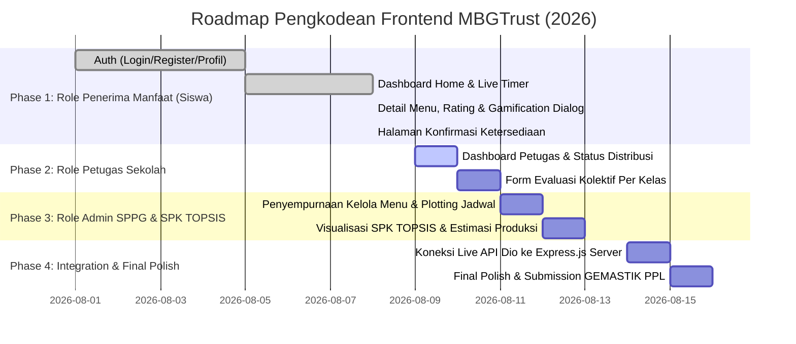

# Master Product Requirement Document (PRD) & Technical Roadmap
## MBGTrust — Frontend Client Layer (Flutter 3.19 Enterprise Architecture)

**Nama Proyek:** MBGTrust (Sistem Pendukung Keputusan Evaluasi Menu MBG & Estimasi Produksi Presisi)  
**Target Kompetisi:** GEMASTIK — Bidang Pengembangan Perangkat Lunak (PPL)  
**Penulis / Arsitek Utama:** Frontend Lead (Fuadi Dhiyaulhaq)  
**Dokumentasi Acuan:** `docs/api_specification_contract.md`, `docs/backend_prd_and_roadmap.md`, `docs/spesifikasi_teknologi_mbgtrust.md`  
**Stack Teknologi Utama:**  
* 📱 **Client Framework:** Flutter 3.19 (Dart 3.3) — Cross-Platform (Web & Mobile)  
* 🎨 **Design System:** Custom HSL Palette, Material 3, Inter/Outfit Typography, Glassmorphism  
* ⚡ **State Management:** Flutter Riverpod v2.5 / Provider v6.1  
* 🌐 **Networking & Routing:** Dio v5.4 Client + Custom Interceptors, GoRouter v13  
* 🔐 **Storage & Auth:** Flutter Secure Storage (KeyStore / Keychain), JWT Bearer Token  
**Versi Dokumen:** 2.0.0 (Master Exhaustive Edition — 3 User Roles)  
**Status:** Ditetapkan & Mengikat sebagai Panduan Tunggal Pengkodean Frontend  

---

## 1. Strategi Kolaborasi FE & BE (Contract-First Parallel Development)

### ❓ Apakah FE Dulu yang Dibuat Semua Baru BE Bekerja?
**Jawabannya: TIDAK HARUS MENUNGGU.** 

Dalam pengembangan perangkat lunak modern (terutama untuk kompetisi GEMASTIK PPL), Frontend (Fuadi) dan Backend (Daffarael) bekerja **Secara Paralel (Bersamaan)** menggunakan pendekatan **Contract-First Development**:

```text
                     ┌─────────────────────────────────────────┐
                     │ 📜 Kontrak API (api_specification.md)   │
                     └────────────────────┬────────────────────┘
                                          │
                   ┌──────────────────────┴──────────────────────┐
                   │                                             │
    ┌──────────────▼──────────────┐               ┌──────────────▼──────────────┐
    │ 📱 FRONTEND LAYER (Fuadi)   │               │ ⚙️ BACKEND LAYER (Daffarael)│
    │ - Buat Seluruh UI/UX Layar  │               │ - Buat Server Node.js/Express│
    │ - Buat Flow State Management│  DIKERJAKAN   │ - Buat Prisma ORM & MySQL   │
    │ - DTO & Mock Fallback Repo  │  PARALEL/     │ - SPK TOPSIS Engine Algorithm│
    │ - Zero CORS Browser Demo    │  BERSAMAAN    │ - Endpoint Controller & Zod │
    └──────────────┬──────────────┘               └──────────────┬──────────────┘
                   │                                             │
                   └──────────────────────┬──────────────────────┘
                                          │
                     ┌────────────────────▼────────────────────┐
                     │ 🚀 KONEKSI API LIVE (Cukup ganti BaseURL)│
                     └─────────────────────────────────────────┘
```

1. **Keuntungan Pendekatan Ini:**
   - Frontend **100% independen** dan dapat menyelesaikan seluruh UI untuk 3 Peran (Penerima Manfaat, Petugas Sekolah, Admin SPPG) tanpa pernah terhambat oleh backend yang belum siap atau kendala CORS browser.
   - Karena DTO dan repository di Frontend sudah mengikuti **Kontrak API** (`api_specification_contract.md`), saat backend selesai, menyambungkannya **hanya butuh waktu 5 menit** cukup dengan mengubah `baseUrl` di `api_client.dart`!

---

## 2. Design System & Tokens Visual Frontend (MBGTrust Design Tokens)

Dokumen ini menjadi rujukan tunggal untuk warna, tipografi, komponen, dan responsivitas agar seluruh UI konsisten dari awal hingga akhir.

### 2.1 Skema Warna Curated HSL (Palette Rules)
Seluruh kode warna wajib mengacu pada token `AppColors` di [`app_colors.dart`](file:///d:/LOMBA/mbgtrust-frontend/MBGTrust/mbgtrust-frontend/lib/core/theme/app_colors.dart):

```dart
abstract class AppColors {
  // Brand Primary (Emerald Green - Segar, Sehat, Terpercaya)
  static const Color primary = Color(0xFF10B981);
  static const Color primaryDark = Color(0xFF065F46);
  static const Color primaryLight = Color(0xFFD1FAE5);

  // Brand Secondary (Warm Gold / Amber - Energi & Nutrisi)
  static const Color secondary = Color(0xFFF59E0B);
  static const Color secondaryDark = Color(0xFFB45309);
  static const Color secondaryLight = Color(0xFFFEF3C7);

  // Background & Surface
  static const Color background = Color(0xFFF9FAFB);
  static const Color surface = Color(0xFFFFFFFF);
  static const Color border = Color(0xFFE5E7EB);

  // Text Typography Colors
  static const Color textPrimary = Color(0xFF111827);
  static const Color textSecondary = Color(0xFF4B5563);
  static const Color textLight = Color(0xFF9CA3AF);

  // Feedback Status
  static const Color success = Color(0xFF10B981);
  static const Color error = Color(0xFFEF4444);
  static const Color warning = Color(0xFFF59E0B);
}
```

### 2.2 Aturan Responsivitas Layout (HP & PC Cross-Platform Rule)
Untuk mencegah tampilan gepeng/lebar di layar PC/Web, atau garis *Right Overflowed* di ponsel:
1. **Container Wrapper Utama:** Setiap `body` pada `Scaffold` **WAJIB** dibungkus dengan:
   ```dart
   body: Center(
     child: Container(
       constraints: const BoxConstraints(maxWidth: 640),
       child: ...
     ),
   )
   ```
2. **Text Overflow Guard:** Setiap `Text` di dalam `Row` **WAJIB** dibungkus dengan `Flexible` atau `Expanded` dan menyertakan `overflow: TextOverflow.ellipsis`.

---

## 3. Spesifikasi Komponen UI Reusable (Component Library)

Semua komponen berikut adalah modul reusable yang digunakan di seluruh layar:

1. **`CustomButton`** ([`custom_button.dart`](file:///d:/LOMBA/mbgtrust-frontend/MBGTrust/mbgtrust-frontend/lib/core/widgets/custom_button.dart)):
   - Memiliki status `isLoading`, `prefixIcon`, border rounded 14px, dan teks yang fleksibel agar tidak overflow.
2. **`CustomTextField`** ([`custom_text_field.dart`](file:///d:/LOMBA/mbgtrust-frontend/MBGTrust/mbgtrust-frontend/lib/core/widgets/custom_text_field.dart)):
   - Mendukung label, hint, suffix icon (termasuk toggle mata password), dan error text.
3. **`MenuDetailCard` / Standard Header Menu**:
   - Berisi `SliverAppBar` 280px Hero Image, gradient overlay, badge *Program Gizi Gratis*, badge rating `4.8 ⭐`, 4 Badges Nutrisi (Energi, Protein, Karbo, Lemak), dan daftar bahan makanan sehat (`_IngredientTile`).
4. **`GamificationCelebrationDialog`**:
   - Dialog apresiasi popup dengan animasi trofi 🏆, perolehan `+50 XP Pahlawan Anti-Food Waste`, status unlock, dan tombol navigasi langsung.

---

## 4. Pemetaan Ekshaustif 3 Peran Pengguna (3 User Roles Requirements)

### 🟢 PERAN 1: PENERIMA MANFAAT (Siswa/Siswi) — [STATUS: 100% DONE ✅]

Siswa mengakses aplikasi untuk melihat menu, memberikan ulasan rasa makanan hari ini, dan mengonfirmasi ketersediaan porsi esok hari.

#### Rincian Rute Layar & Spesifikasi API:

1. **Layar Login (`/login`)**:
   - **File:** [`login_screen.dart`](file:///d:/LOMBA/mbgtrust-frontend/MBGTrust/mbgtrust-frontend/lib/features/auth/presentation/login_screen.dart)
   - **Fungsi:** Masuk dengan NISN & Password. Menyediakan opsi masuk cepat (*Fast Demo Login*) untuk Faizullatif Fajran (Penerima Manfaat) dan Admin SPPG.
   - **Endpoint API:** `POST /api/v1/otentikasi/masuk`

2. **Layar Registrasi (`/register`)**:
   - **File:** [`register_screen.dart`](file:///d:/LOMBA/mbgtrust-frontend/MBGTrust/mbgtrust-frontend/lib/features/auth/presentation/register_screen.dart)
   - **Fungsi:** Pendaftaran siswa baru dengan pilihan Sekolah, Kelas, dan Multi-select Riwayat Alergi (Kacang Tanah, Udang, Telur, dll).
   - **Endpoint API:** `POST /api/v1/otentikasi/pendaftaran`

3. **Beranda Utama (`/home`)**:
   - **File:** [`home_screen.dart`](file:///d:/LOMBA/mbgtrust-frontend/MBGTrust/mbgtrust-frontend/lib/features/home/presentation/home_screen.dart)
   - **Fitur Utama:**
     - Banner Profil Siswa (*Faizullatif Fajran • MAN 2 Kota Padang • XII.FA-3*).
     - Kartu Ringkasan Kehadiran & Total Porsi Diterima.
     - **Live Countdown Timer Realtime SPPG** (`04 Jam : 18 Menit : 30 Detik • Batas 17:00 WIB`).
     - **Kartu 1 (Evaluasi Hari Ini):** Tombol membuka ulasan rasa makanan.
     - **Kartu 2 (Konfirmasi Ketersediaan Besok):** *Locked/Terkunci* secara default, baru *Unlocked/Terbuka* jika ulasan hari ini sudah dikirim.
   - **Endpoint API:** `GET /api/v1/jadwal/hari-ini` & `GET /api/v1/jadwal/besok`

4. **Halaman Detail & Ulasan Menu Hari Ini (`/menu-detail`)**:
   - **File:** [`menu_detail_screen.dart`](file:///d:/LOMBA/mbgtrust-frontend/MBGTrust/mbgtrust-frontend/lib/features/evaluation/presentation/menu_detail_screen.dart) & [`rating_section.dart`](file:///d:/LOMBA/mbgtrust-frontend/MBGTrust/mbgtrust-frontend/lib/features/evaluation/presentation/rating_section.dart)
   - **Fitur Utama:**
     - Standard Menu View (Hero Image 280px, Nutrisi, Bahan Makanan Sehat).
     - Form Evaluasi 5 Pertanyaan: Penilaian Rasa (1-5 ⭐), Kesukaan (1-5 ⭐), Porsi (1-5 ⭐), Slider Sisa Makanan (0% - 100% dengan Status Card di bawah garis slider), dan Catatan Kualitatif.
     - **Gamification Celebration Dialog:** Memicu popup trofi `+50 XP Pahlawan Anti-Food Waste` dan tombol **"Lanjut Konfirmasi Menu Besok ➔"**.
   - **Endpoint API:** `POST /api/v1/jadwal/:idJadwal/evaluasi`

5. **Halaman Konfirmasi Ketersediaan Menerima (`/next-day-confirmation`)**:
   - **File:** [`next_day_confirmation_screen.dart`](file:///d:/LOMBA/mbgtrust-frontend/MBGTrust/mbgtrust-frontend/lib/features/evaluation/presentation/next_day_confirmation_screen.dart)
   - **Fitur Utama:**
     - Tampilan Menu 100% Sama Persis dengan Halaman Ulasan.
     - **Banner Peringatan Alergi Makanan:** Otomatis mendeteksi alergen matching (*Kacang Tanah*).
     - Opsi Ketersediaan Ringkasi: 🟢 **`Menerima Porsi`** vs 🔴 **`Menolak Porsi`**.
     - Pilihan Alasan Penolakan Baku (`ALERGI`, `SAKIT`, `PANTANGAN_AGAMA`, `IZIN_ABSEN`, `TIDAK_SUKA_MENU`, `LAINNYA`).
   - **Endpoint API:** `POST /api/v1/jadwal/:idJadwal/konfirmasi` & `GET /api/v1/alasan-penolakan`

---

### 🟡 PERAN 2: PETUGAS SEKOLAH (Guru / Koordinator MBG Sekolah) — [UPCOMING TAHAP 2]

Petugas Sekolah bertanggung jawab melakukan pencatatan evaluasi kolektif per kelas untuk siswa yang belum memiliki ponsel pintar.

#### Rincian Rute Layar & Spesifikasi API:

1. **Dashboard Petugas Sekolah (`/school-officer/dashboard`)**:
   - Memantau rekapitulasi kedatangan porsi makanan dari Dapur SPPG ke sekolah hari ini.
   - Status distribusi: *Dalam Perjalanan -> Tiba di Sekolah -> Diberikan ke Siswa*.
   - **Endpoint API:** `GET /api/v1/distribusi/status-sekolah`

2. **Form Evaluasi Kolektif Kelas (`/school-officer/collective-evaluation`)**:
   - **Fungsi:** Mengisi nilai rata-rata rasa dan persentase sisa makanan per kelas (contoh: Kelas XII.FA-3) secara sekaligus.
   - Tabel input cepat siswa (NISN, Menerima/Menolak, Nilai Rasa, Sisa Makanan).
   - **Endpoint API:** `POST /api/v1/jadwal/:idJadwal/evaluasi-kolektif`

---

### 🔵 PERAN 3: ADMIN SPPG (Pengelola Dapur, Menu, SPK TOPSIS & Produksi) — [UPCOMING TAHAP 3]

Admin SPPG mengelola master menu, menyusun jadwal harian, memantau estimasi porsi presisi H+1 untuk mencegah food waste, dan mengeksekusi Engine SPK TOPSIS.

#### Rincian Rute Layar & Spesifikasi API:

1. **Dashboard Eksekutif SPPG (`/sppg/dashboard`)**:
   - Grafik analitik kepuasan penerima manfaat, efisiensi anggaran, dan persentase pengurangan food waste (`fl_chart`).
   - **Endpoint API:** `GET /api/v1/analitik/ringkasan-dasbor`

2. **Kelola Master Menu MBG (`/manage-menu` & `/sppg/add-menu`)**:
   - **File Exists:** [`manage_menu_screen.dart`](file:///d:/LOMBA/mbgtrust-frontend/MBGTrust/mbgtrust-frontend/lib/features/menu/presentation/manage_menu_screen.dart) & [`add_menu_form.dart`](file:///d:/LOMBA/mbgtrust-frontend/MBGTrust/mbgtrust-frontend/lib/features/menu/presentation/add_menu_form.dart)
   - Tambah/edit menu baru (Nama, Kalori, Protein, Karbo, Lemak, Bahan, Alergen, Cost per porsi).
   - **Endpoint API:** `POST, GET, PATCH /api/v1/menu`

3. **Plotting Jadwal Menu Harian (`/create-schedule`)**:
   - **File Exists:** [`create_schedule_screen.dart`](file:///d:/LOMBA/mbgtrust-frontend/MBGTrust/mbgtrust-frontend/lib/features/menu/presentation/create_schedule_screen.dart)
   - Menentukan menu untuk tanggal tertentu dan sekolah target.
   - **Endpoint API:** `POST /api/v1/jadwal`

4. **Rekap Estimasi Produksi Presisi H+1 (`/estimation`)**:
   - **File Exists:** [`estimation_screen.dart`](file:///d:/LOMBA/mbgtrust-frontend/MBGTrust/mbgtrust-frontend/lib/features/production/presentation/estimation_screen.dart)
   - Menampilkan total porsi dasar vs total siswa konfirmasi hadir vs total siswa menolak = **Total Porsi Presisi Wajib Dimasak**.
   - **Endpoint API:** `GET /api/v1/rencana-produksi/harian` & `POST /api/v1/rencana-produksi/harian/hitung`

5. **Engine SPK TOPSIS Evaluasi Menu (`/sppg/topsis-spk-engine`)**:
   - Memproses skor preferensi matematika TOPSIS untuk menentukan menu terbaik dan menu yang perlu direvisi/diganti.
   - **Endpoint API:** `POST /api/v1/spk/topsis/eksekusi` & `GET /api/v1/spk/topsis/rekomendasi`

6. **Tracker Distribusi Logistik (`/distribution-tracker`)**:
   - **File Exists:** [`distribution_tracker_screen.dart`](file:///d:/LOMBA/mbgtrust-frontend/MBGTrust/mbgtrust-frontend/lib/features/distribution/presentation/distribution_tracker_screen.dart)
   - Memantau status pengiriman armada dapur ke sekolah-sekolah real-time.
   - **Endpoint API:** `PATCH /api/v1/distribusi/:idDistribusi/status`

---

## 5. Master Roadmap Implementation Plan (Frontend Execution Phase)



---

## 6. Panduan Eksekusi Pengkodean Selanjutnya (Developer Guideline)

Untuk pengerjaan fitur selanjutnya (Role Petugas Sekolah & Admin SPPG), pengembang (Fuadi) **cukup merujuk ke Dokumen PRD Master ini**:

1. Pastikan setiap layar baru dibungkus dengan `Center(child: Container(constraints: BoxConstraints(maxWidth: 640)...))` untuk menjamin responsivitas.
2. Gunakan komponen dari [`widgets.dart`](file:///d:/LOMBA/mbgtrust-frontend/MBGTrust/mbgtrust-frontend/lib/core/widgets/widgets.dart) (`CustomButton`, `CustomTextField`, `AppColors`).
3. Selalu buat Repository Layer terlebih dahulu di `data/repositories/` dengan objek Model DTO yang sesuai dengan `docs/api_specification_contract.md`.
