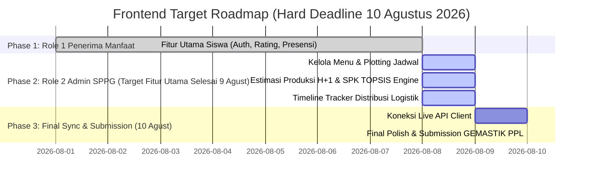

# Master Product Requirement Document (PRD) & Technical Roadmap
## MBGTrust — Frontend Client Layer (Flutter 3.19 Enterprise Architecture)

**Nama Proyek:** MBGTrust (Sistem Pendukung Keputusan Evaluasi Menu MBG & Estimasi Produksi Presisi)  
**Target Kompetisi:** GEMASTIK — Bidang Pengembangan Perangkat Lunak (PPL)  
**Penulis / Arsitek Utama:** Frontend Lead (Fuadi Dhiyaulhaq)  
**Dokumentasi Acuan:** `docs/api_specification_contract.md`, `docs/backend_prd_and_roadmap.md`, `docs/spesifikasi_teknologi_mbgtrust.md`, `docs/dokumentasi_gagasan_awal_mbgtrust.md`  
**Stack Teknologi Utama:**  
* 📱 **Client Framework:** Flutter 3.19 (Dart 3.3) — Cross-Platform (Web, Tablet & Mobile Responsive)  
* 🎨 **Design System:** Custom HSL Palette, Material 3, Inter/Outfit Typography, Glassmorphism  
* ⚡ **State Management:** Flutter Riverpod v2.5 / Provider v6.1  
* 🌐 **Networking & Routing:** Dio v5.4 Client + Custom Interceptors, GoRouter v13  
* 🔐 **Storage & Auth:** Flutter Secure Storage (KeyStore / Keychain), JWT Bearer Token  
**Versi Dokumen:** 4.0.0 (Target Hard Deadline 10 Agustus 2026 Edition)  
**Status:** Ditetapkan & Mengikat sebagai Panduan Tunggal Pengkodean Frontend  

---

## 1. Arsitektur Sistem 2 Peran Utama & Moda Kios Sekolah

Sesuai dengan **Dokumentasi Gagasan Awal (`docs/dokumentasi_gagasan_awal_mbgtrust.md`)** dan **Spesifikasi Teknologi (`docs/spesifikasi_teknologi_mbgtrust.md`)**, sistem MBGTrust berfokus secara ketat pada **2 PERAN UTAMA (2 User Roles)**:

```text
               ┌─────────────────────────────────────────────────────────┐
               │                🌐 PLATFORM MBGTRUST                     │
               └────────────┬───────────────────────────────┬────────────┘
                            │                               │
             ┌──────────────▼──────────────┐  ┌─────────────▼──────────────┐
             │ 🟢 ROLE 1: PENERIMA MANFAAT │  │ 🔵 ROLE 2: ADMIN SPPG     │
             │ (Siswa / Siswi Sekolah)     │  │ (Pengelola Dapur SPPG)    │
             └──────────────┬──────────────┘  └─────────────┬──────────────┘
                            │                               │
             ┌──────────────┴──────────────┐                │
             │                             │                │
   ┌─────────▼──────────┐        ┌─────────▼──────────┐     │
   │ 📱 Perangkat Pribadi│        │ 🖥️ Kios/Tablet Sekolah│    │
   │ (HP Siswa)         │        │ (Fasilitas Sekolah)│     │
   │ - Login NISN Akun  │        │ - Login NISN Akun  │     │
   │ - Ulasan & Presensi│        │ - Ulasan & Presensi│     │
   └────────────────────┘        └────────────────────┘     │
                                                            │
                                  ┌─────────────────────────▼──────────┐
                                  │ ⚙️ Dapur SPPG & Support Engine      │
                                  │ - Master Menu & Plotting Jadwal    │
                                  │ - Estimasi Produksi H+1 Zero Waste │
                                  │ - Engine SPK TOPSIS Evaluasi Menu  │
                                  │ - Tracking Logistik & Distribusi   │
                                  └────────────────────────────────────┘
```

---

## 2. Design System & Tokens Visual Frontend

### 2.1 Skema Warna Curated HSL (Palette Rules)
```dart
abstract class AppColors {
  static const Color primary = Color(0xFF10B981); // Emerald Green
  static const Color primaryDark = Color(0xFF065F46);
  static const Color primaryLight = Color(0xFFD1FAE5);
  static const Color secondary = Color(0xFFF59E0B); // Warm Gold
  static const Color secondaryDark = Color(0xFFB45309);
  static const Color secondaryLight = Color(0xFFFEF3C7);
  static const Color background = Color(0xFFF9FAFB);
  static const Color surface = Color(0xFFFFFFFF);
  static const Color border = Color(0xFFE5E7EB);
  static const Color textPrimary = Color(0xFF111827);
  static const Color textSecondary = Color(0xFF4B5563);
  static const Color textLight = Color(0xFF9CA3AF);
  static const Color success = Color(0xFF10B981);
  static const Color error = Color(0xFFEF4444);
}
```

### 2.2 Aturan Responsivitas Layout (HP, Tablet & PC Cross-Platform Rule)
Setiap `body` pada `Scaffold` **WAJIB** dibungkus dengan:
```dart
body: Center(
  child: Container(
    constraints: const BoxConstraints(maxWidth: 640),
    child: ...
  ),
)
```

---

## 3. Pemetaan 2 Peran Utama & Target Fitur Utama

### 🟢 PERAN 1: PENERIMA MANFAAT (Siswa / Siswi Sekolah) — [STATUS: 100% SELESAI ✅]
1. **Otentikasi Login & Register (`/login`, `/register`)**: Fast Demo Login & Deteksi Riwayat Alergi.
2. **Beranda Utama & Live Countdown Timer (`/home`)**: Live Timer Batas SPPG (17:00 WIB) & Lock Logic.
3. **Detail & Ulasan Menu Hari Ini (`/menu-detail`)**: Form 5 Pertanyaan (⭐ & Slider 0%-100%) + Gamification Celebration Dialog (`+50 XP`).
4. **Halaman Konfirmasi Ketersediaan Menerima (`/next-day-confirmation`)**: 100% Identik Tampilan Menu + Warning Alergi.

---

### 🔵 PERAN 2: ADMIN SPPG (Pengelola Dapur SPPG & Support Engine) — [TARGET SELESAI 9 AGUSTUS 🚀]
1. **Pengelolaan Master Menu & Plotting Jadwal (`/manage-menu`, `/create-schedule`)**: Tambah/edit menu, harga per porsi, nutrisi & tanggal jadwal sekolah.
2. **Rekap Estimasi Produksi Presisi H+1 Zero Waste (`/estimation`)**: Perhitungan Porsi Dasar vs Siswa Konfirmasi Hadir vs Siswa Menolak = Total Porsi Wajib Dimasak.
3. **Engine SPK TOPSIS Evaluasi Menu (`/sppg/topsis-spk-engine`)**: Visualisasi skor preferensi matematika TOPSIS untuk menentukan menu rekomendasi vs menu revisi.
4. **Pelacakan Logistik Distribusi (`/distribution-tracker`)**: Timeline status pengiriman dapur ke sekolah target.

---

## 4. Technical Roadmap GEMASTIK (Deadline 10 Agustus 2026)



### 📌 Target Milestone Pengkodean:
- **Minggu, 9 Agustus 2026 (Target 23:59 WIB):** Seluruh Fitur Utama untuk **Role 1 (Siswa)** & **Role 2 (Admin SPPG)** selesai dikodekan 100% dan dapat diuji.
- **Senin, 10 Agustus 2026 (Target Final Submission):** Penyelarasan API Live, pembersihan akhir (*Final Polish*), dan penyerahan karya GEMASTIK PPL.
