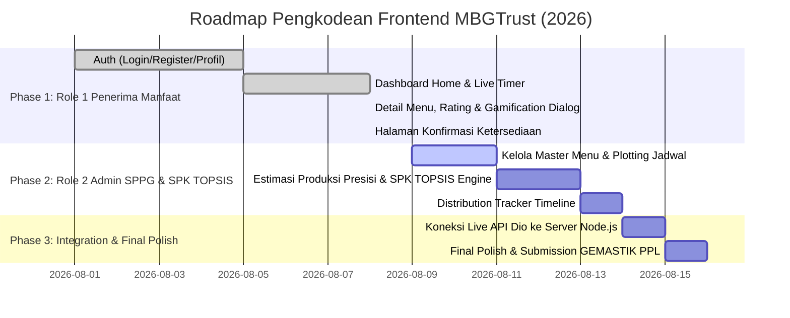

# Master Product Requirement Document (PRD) & Technical Roadmap
## MBGTrust — Frontend Client Layer (Flutter 3.19 Enterprise Architecture)

**Nama Proyek:** MBGTrust (Sistem Pendukung Keputusan Evaluasi Menu MBG & Estimasi Produksi Presisi)  
**Target Kompetisi:** GEMASTIK — Bidang Pengembangan Perangkat Lunak (PPL)  
**Penulis / Arsitek Utama:** Frontend Lead (Fuadi Dhiyaulhaq)  
**Dokumentasi Acuan:** `docs/api_specification_contract.md`, `docs/backend_prd_and_roadmap.md`, `docs/spesifikasi_teknologi_mbgtrust.md`, `docs/dokumentasi_gagasan_awal_mbgtrust.md`  
**Stack Teknologi Utama:**  
* 📱 **Client Framework:** Flutter 3.19 (Dart 3.3) — Cross-Platform (Web, Tablet & Mobile Responsive)  
* 🎨 **Design System:** Custom HSL Palette, Material 3, Inter/Outfit Typography, Glassmorphism  
* ⚡ **State Management:** Flutter Riverpod v2.5 / Provider v6.1  
* 🌐 **Networking & Routing:** Dio v5.4 Client + Custom Interceptors, GoRouter v13  
* 🔐 **Storage & Auth:** Flutter Secure Storage (KeyStore / Keychain), JWT Bearer Token  
**Versi Dokumen:** 3.0.0 (Strict 2-Role System & Shared Kiosk Mode Edition)  
**Status:** Ditetapkan & Mengikat sebagai Panduan Tunggal Pengkodean Frontend  

---

## 1. Arsitektur Sistem 2 Peran Utama & Moda Kios Sekolah

Sesuai dengan **Dokumentasi Gagasan Awal (`docs/dokumentasi_gagasan_awal_mbgtrust.md`)** dan **Spesifikasi Teknologi (`docs/spesifikasi_teknologi_mbgtrust.md`)**, sistem MBGTrust berfokus secara ketat pada **2 PERAN UTAMA (2 User Roles)**:

```text
               ┌─────────────────────────────────────────────────────────┐
               │                🌐 PLATFORM MBGTRUST                     │
               └────────────┬───────────────────────────────┬────────────┘
                            │                               │
             ┌──────────────▼──────────────┐  ┌─────────────▼──────────────┐
             │ 🟢 ROLE 1: PENERIMA MANFAAT │  │ 🔵 ROLE 2: ADMIN SPPG     │
             │ (Siswa / Siswi Sekolah)     │  │ (Pengelola Dapur SPPG)    │
             └──────────────┬──────────────┘  └─────────────┬──────────────┘
                            │                               │
             ┌──────────────┴──────────────┐                │
             │                             │                │
   ┌─────────▼──────────┐        ┌─────────▼──────────┐     │
   │ 📱 Perangkat Pribadi│        │ 🖥️ Kios/Tablet Sekolah│    │
   │ (HP Siswa)         │        │ (Fasilitas Sekolah)│     │
   │ - Login NISN Akun  │        │ - Login NISN Akun  │     │
   │ - Ulasan & Presensi│        │ - Ulasan & Presensi│     │
   └────────────────────┘        └────────────────────┘     │
                                                            │
                                  ┌─────────────────────────▼──────────┐
                                  │ ⚙️ Dapur SPPG & Support Engine      │
                                  │ - Master Menu & Plotting Jadwal    │
                                  │ - Estimasi Produksi H+1 Zero Waste │
                                  │ - Engine SPK TOPSIS Evaluasi Menu  │
                                  │ - Tracking Logistik & Distribusi   │
                                  └────────────────────────────────────┘
```

### 💡 Penanganan Siswa yang Tidak Membawa HP (Moda Kios/Tablet Sekolah)
- Siswa yang tidak membawa HP **TIDAK memerlukan peran/portal terpisah**.
- Sekolah menyediakan perangkat bersama (*Tablet / Kios Sekolah / HP Wali Kelas*).
- Siswa **tetap login menggunakan NISN & Kata Sandi milik masing-masing** (`POST /api/v1/otentikasi/masuk`), mengisi ulasan makanan hari ini & konfirmasi ketersediaan besok, lalu keluar (*logout*) secara aman untuk digantikan siswa berikutnya.

---

## 2. Design System & Tokens Visual Frontend (MBGTrust Design Tokens)

Dokumen ini menjadi rujukan tunggal untuk warna, tipografi, komponen, dan responsivitas agar seluruh UI konsisten dari awal hingga akhir.

### 2.1 Skema Warna Curated HSL (Palette Rules)
Seluruh kode warna wajib mengacu pada token `AppColors` di [`app_colors.dart`](file:///d:/LOMBA/mbgtrust-frontend/MBGTrust/mbgtrust-frontend/lib/core/theme/app_colors.dart):

```dart
abstract class AppColors {
  // Brand Primary (Emerald Green - Segar, Sehat, Terpercaya)
  static const Color primary = Color(0xFF10B981);
  static const Color primaryDark = Color(0xFF065F46);
  static const Color primaryLight = Color(0xFFD1FAE5);

  // Brand Secondary (Warm Gold / Amber - Energi & Nutrisi)
  static const Color secondary = Color(0xFFF59E0B);
  static const Color secondaryDark = Color(0xFFB45309);
  static const Color secondaryLight = Color(0xFFFEF3C7);

  // Background & Surface
  static const Color background = Color(0xFFF9FAFB);
  static const Color surface = Color(0xFFFFFFFF);
  static const Color border = Color(0xFFE5E7EB);

  // Text Typography Colors
  static const Color textPrimary = Color(0xFF111827);
  static const Color textSecondary = Color(0xFF4B5563);
  static const Color textLight = Color(0xFF9CA3AF);

  // Feedback Status
  static const Color success = Color(0xFF10B981);
  static const Color error = Color(0xFFEF4444);
  static const Color warning = Color(0xFFF59E0B);
}
```

### 2.2 Aturan Responsivitas Layout (HP, Tablet & PC Cross-Platform Rule)
Untuk mencegah tampilan gepeng/lebar di layar PC/Web atau garis *Right Overflowed* di ponsel/tablet:
1. **Container Wrapper Utama:** Setiap `body` pada `Scaffold` **WAJIB** dibungkus dengan:
   ```dart
   body: Center(
     child: Container(
       constraints: const BoxConstraints(maxWidth: 640),
       child: ...
     ),
   )
   ```
2. **Text Overflow Guard:** Setiap `Text` di dalam `Row` **WAJIB** dibungkus dengan `Flexible` atau `Expanded` dan menyertakan `overflow: TextOverflow.ellipsis`.

---

## 3. Pemetaan Rinci 2 Peran Utama Pengguna (2 User Roles Mapping)

---

### 🟢 PERAN 1: PENERIMA MANFAAT (Siswa / Siswi Sekolah) — [STATUS: 100% SELESAI ✅]

Siswa mengakses aplikasi (baik dari HP Pribadi maupun Tablet/Kios Sekolah) untuk melihat menu, memberikan umpan balik ulasan makanan hari ini, dan mengonfirmasi ketersediaan porsi esok hari.

#### Rincian Rute Layar & Spesifikasi API:

1. **Layar Login (`/login`)**:
   - **File:** [`login_screen.dart`](file:///d:/LOMBA/mbgtrust-frontend/MBGTrust/mbgtrust-frontend/lib/features/auth/presentation/login_screen.dart)
   - **Fungsi:** Masuk dengan NISN & Password masing-masing. Menyediakan tombol *Fast Demo Login* untuk Faizullatif Fajran dan Admin SPPG.
   - **Endpoint API:** `POST /api/v1/otentikasi/masuk`

2. **Layar Registrasi (`/register`)**:
   - **File:** [`register_screen.dart`](file:///d:/LOMBA/mbgtrust-frontend/MBGTrust/mbgtrust-frontend/lib/features/auth/presentation/register_screen.dart)
   - **Fungsi:** Pendaftaran siswa baru dengan pilihan Sekolah, Kelas, dan Multi-select Riwayat Alergi (Kacang Tanah, Udang, Telur, dll).
   - **Endpoint API:** `POST /api/v1/otentikasi/pendaftaran`

3. **Layar Profil & Alergi (`/profile`)**:
   - **File:** [`profile_screen.dart`](file:///d:/LOMBA/mbgtrust-frontend/MBGTrust/mbgtrust-frontend/lib/features/auth/presentation/profile_screen.dart)
   - **Fungsi:** Melihat data NISN, Sekolah, Kelas, dan mengelola daftar alergi makanan pribadi.
   - **Endpoint API:** `GET & PATCH /api/v1/pengguna/profil-saya`

4. **Beranda Utama (`/home`)**:
   - **File:** [`home_screen.dart`](file:///d:/LOMBA/mbgtrust-frontend/MBGTrust/mbgtrust-frontend/lib/features/home/presentation/home_screen.dart)
   - **Fitur Utama:**
     - Banner Profil Siswa (*Faizullatif Fajran • MAN 2 Kota Padang • XII.FA-3*).
     - Kartu Ringkasan Kehadiran & Total Porsi Diterima.
     - **Live Countdown Timer Realtime SPPG** (`04 Jam : 18 Menit : 30 Detik • Batas 17:00 WIB`).
     - **Kartu 1 (Evaluasi Hari Ini):** Tombol membuka ulasan rasa makanan.
     - **Kartu 2 (Konfirmasi Ketersediaan Besok):** *Locked/Terkunci* secara default, baru *Unlocked/Terbuka* jika ulasan hari ini sudah dikirim.
   - **Endpoint API:** `GET /api/v1/jadwal/hari-ini` & `GET /api/v1/jadwal/besok`

5. **Halaman Detail & Ulasan Menu Hari Ini (`/menu-detail`)**:
   - **File:** [`menu_detail_screen.dart`](file:///d:/LOMBA/mbgtrust-frontend/MBGTrust/mbgtrust-frontend/lib/features/evaluation/presentation/menu_detail_screen.dart) & [`rating_section.dart`](file:///d:/LOMBA/mbgtrust-frontend/MBGTrust/mbgtrust-frontend/lib/features/evaluation/presentation/rating_section.dart)
   - **Fitur Utama:**
     - Standard Menu View (SliverAppBar 280px Hero Image, Badges Nutrisi, Bahan Makanan Sehat `_IngredientTile`).
     - Form Evaluasi 5 Pertanyaan: Penilaian Rasa (1-5 ⭐), Kesukaan (1-5 ⭐), Porsi (1-5 ⭐), Slider Sisa Makanan (0% - 100% dengan Status Card di bawah garis slider), dan Catatan Kualitatif.
     - **Gamification Celebration Dialog:** Memicu popup trofi `+50 XP Pahlawan Anti-Food Waste` dan tombol **"Lanjut Konfirmasi Menu Besok ➔"**.
   - **Endpoint API:** `POST /api/v1/jadwal/:idJadwal/evaluasi`

6. **Halaman Konfirmasi Ketersediaan Menerima (`/next-day-confirmation`)**:
   - **File:** [`next_day_confirmation_screen.dart`](file:///d:/LOMBA/mbgtrust-frontend/MBGTrust/mbgtrust-frontend/lib/features/evaluation/presentation/next_day_confirmation_screen.dart)
   - **Fitur Utama:**
     - Tampilan Menu 100% Sama Persis dengan Halaman Ulasan (`SliverAppBar` 280px Hero Image, Badges Nutrisi, `_IngredientTile`).
     - **Banner Peringatan Alergi Makanan:** Otomatis mendeteksi alergen matching (*Kacang Tanah*).
     - Opsi Ketersediaan Ringkas: 🟢 **`Menerima Porsi`** vs 🔴 **`Menolak Porsi`**.
     - Pilihan Alasan Penolakan Baku (`ALERGI`, `SAKIT`, `PANTANGAN_AGAMA`, `IZIN_ABSEN`, `TIDAK_SUKA_MENU`, `LAINNYA`).
   - **Endpoint API:** `POST /api/v1/jadwal/:idJadwal/konfirmasi` & `GET /api/v1/alasan-penolakan`

---

### 🔵 PERAN 2: ADMIN SPPG (Pengelola Dapur SPPG & Support Engine) — [UPCOMING TAHAP 2]

Admin SPPG mengelola master menu, menyusun jadwal harian, memantau estimasi porsi presisi H+1 untuk mencegah food waste, mengeksecusi Engine SPK TOPSIS, dan memantau pelacakan distribusi logistik.

#### Rincian Rute Layar & Spesifikasi API:

1. **Dashboard Utama Admin SPPG (`/estimation` / `/sppg/dashboard`)**:
   - **File Exists:** [`estimation_screen.dart`](file:///d:/LOMBA/mbgtrust-frontend/MBGTrust/mbgtrust-frontend/lib/features/production/presentation/estimation_screen.dart)
   - Grafik analitik kepuasan penerima manfaat, efisiensi anggaran, dan persentase pengurangan food waste (`fl_chart`).
   - **Rekap Estimasi Produksi Presisi H+1:** Menampilkan Total Porsi Dasar vs Siswa Konfirmasi Hadir vs Siswa Menolak = **Total Porsi Presisi Wajib Dimasak**.
   - **Endpoint API:** `GET /api/v1/analitik/ringkasan-dasbor` & `GET /api/v1/rencana-produksi/harian`

2. **Pengelolaan Master Menu MBG (`/manage-menu` & `/sppg/add-menu`)**:
   - **File Exists:** [`manage_menu_screen.dart`](file:///d:/LOMBA/mbgtrust-frontend/MBGTrust/mbgtrust-frontend/lib/features/menu/presentation/manage_menu_screen.dart) & [`add_menu_form.dart`](file:///d:/LOMBA/mbgtrust-frontend/MBGTrust/mbgtrust-frontend/lib/features/menu/presentation/add_menu_form.dart)
   - Tambah/edit master menu baru (Nama Menu, Kalori, Protein, Karbo, Lemak, Komposisi Bahan, Alergen, Estimasi Biaya per porsi).
   - **Endpoint API:** `POST, GET, PATCH /api/v1/menu`

3. **Plotting Jadwal Menu Harian (`/create-schedule`)**:
   - **File Exists:** [`create_schedule_screen.dart`](file:///d:/LOMBA/mbgtrust-frontend/MBGTrust/mbgtrust-frontend/lib/features/menu/presentation/create_schedule_screen.dart)
   - Menyusun alokasi menu untuk tanggal tertentu dan daftar sekolah target (contoh: MAN 2 Kota Padang).
   - **Endpoint API:** `POST /api/v1/jadwal`

4. **Engine SPK TOPSIS Evaluasi Menu (`/sppg/topsis-spk-engine`)**:
   - Memproses skor preferensi matematika TOPSIS dari hasil masukan ulasan rasa & sisa makanan siswa untuk menentukan rangking menu terbaik.
   - **Endpoint API:** `POST /api/v1/spk/topsis/eksekusi` & `GET /api/v1/spk/topsis/rekomendasi`

5. **Pelacakan Distribusi Logistik Makanan (`/distribution-tracker`)**:
   - **File Exists:** [`distribution_tracker_screen.dart`](file:///d:/LOMBA/mbgtrust-frontend/MBGTrust/mbgtrust-frontend/lib/features/distribution/presentation/distribution_tracker_screen.dart)
   - **Timeline Tracking Standar:**
     - 🟡 *Masak & Dikemas di Dapur SPPG*
     - 🔵 *Kurir Logistik dalam Perjalanan*
     - 🟢 *Tiba & Diterima di Sekolah Target*
   - Memperbarui status pengiriman logistik dapur real-time.
   - **Endpoint API:** `PATCH /api/v1/distribusi/:idDistribusi/status`

---

## 4. Master Roadmap Execution Plan


